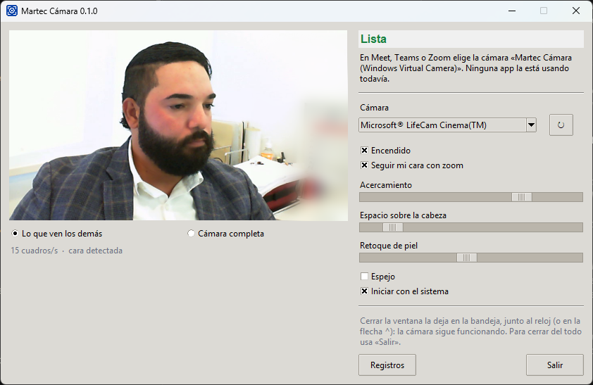

<p align="center"></p>

<h1 align="center">Martec Cámara</h1>

<p align="center">
  <a href="https://github.com/lmarte24/martec-camara/releases/latest"></a>
  <a href="https://github.com/lmarte24/martec-camara/releases"></a>
  <a href="https://github.com/lmarte24/martec-camara/stargazers"></a>
  <a href="https://www.paypal.com/donate/?business=luismarte1990%40gmail.com&item_name=Martec+C%C3%A1mara&currency_code=USD"></a>
  <a href="LICENSE"></a>
</p>

Encuadre automático con zoom y retoque de piel para cualquier webcam, en
Windows y Mac. Tu cara queda centrada aunque te muevas, y la imagen llega así a
Google Meet, Microsoft Teams, Zoom, WhatsApp o cualquier app de video.

Gratis y de código abierto. Un regalo de Martec a la comunidad.

<p align="center"></p>

## Descargar

| Sistema | Descarga |
|---|---|
| **Windows 10 y 11** | [`MartecCamara-<versión>-instalador.exe`](https://github.com/lmarte24/martec-camara/releases/latest) (un solo instalador, no necesita nada más) |
| **Mac** (Apple Silicon, experimental) | [`MartecCamara-<versión>-mac-arm64.zip`](https://github.com/lmarte24/martec-camara/releases/latest). Todavía sin probar en una Mac real: si la pruebas, cuéntanos cómo te fue |

Los pasos de instalación están [más abajo](#instalación).

## ¿Te sirvió?

- **Califícala con una estrella.** Botón **Star** arriba a la derecha de esta
  página: así se califica en GitHub, y ayuda a que otros la encuentren.
- **Cuéntanos qué tal** en [Discussions](https://github.com/lmarte24/martec-camara/discussions),
  o reporta un problema en [Issues](https://github.com/lmarte24/martec-camara/issues).
- **Apoya el proyecto.** Es gratis y lo seguirá siendo. Si quieres invitarnos
  un café, cualquier monto ayuda a mantenerlo:

  <a href="https://www.paypal.com/donate/?business=luismarte1990%40gmail.com&item_name=Martec+C%C3%A1mara&currency_code=USD"></a>

## Qué hace

- **Sigue tu cara con zoom.** Recorta la imagen alrededor de tu cara y la
  mantiene centrada, con movimiento suave y sin cortarte la cabeza.
- **Retoque de piel.** Suaviza espinillas y poros solo en la piel de la cara,
  sin tocar ojos, cejas, barba ni el fondo.
- **Funciona con cualquier webcam**, también las que no traen seguimiento
  propio. Muchas webcams dicen tener zoom y giro en el firmware pero no lo
  aplican; por eso el zoom se hace por software.
- **Todo local.** La imagen se procesa en tu equipo y no se envía a internet.

## Instalación

### Windows 10 y 11 (probado en Windows 11)

Un solo instalador, sin nada más que instalar: trae su propio driver de cámara
virtual.

1. Descarga y abre `MartecCamara-<versión>-instalador.exe` desde
   [la última versión](https://github.com/lmarte24/martec-camara/releases/latest).
   - Si aparece *"Windows protegió su PC"*: **Más información** > **Ejecutar de
     todas formas**. Sale porque el instalador no tiene firma digital paga.
   - Windows pide permiso de administrador: hace falta para registrar la
     cámara virtual.
2. Al abrir la app, si Windows pregunta si puede usar la cámara, elige **Permitir**.
3. Elige la cámara de Martec en tu app de video (Meet, Teams, Zoom, Chrome,
   Edge, WhatsApp):
   - **Windows 11:** **Martec Cámara (Windows Virtual Camera)**. Windows le
     agrega el sufijo entre paréntesis.
   - **Windows 10:** **Martec Cámara**. WhatsApp y las demás apps de la
     Microsoft Store no la ven en Windows 10.

Tu webcam se enciende sola cuando una app abre "Martec Cámara" y se suelta
cuando ya nadie la usa. Se desinstala desde **Configuración > Aplicaciones**.

### Mac (Apple Silicon, macOS 14 o posterior), experimental

La versión de Mac se compila en GitHub Actions y todavía no se ha probado en
una Mac real. Si la pruebas, cuéntanos en
[Issues](https://github.com/lmarte24/martec-camara/issues) cómo te fue.

En Mac hace falta [OBS Studio](https://obsproject.com) (gratis) por su cámara
virtual.

1. Instala OBS Studio, ábrelo **una vez**, acepta la extensión de cámara que
   pide macOS y ciérralo.
2. Descarga `MartecCamara-<versión>-mac-arm64.zip`, descomprímelo y arrastra
   **MartecCamara.app** a **Aplicaciones**.
3. La primera vez ábrela con **clic derecho > Abrir**. Si macOS no lo permite:
   **Configuración del Sistema > Privacidad y seguridad > Abrir de todos modos**.
4. Permite el acceso a la cámara.
5. En Meet, Teams o Zoom elige **OBS Virtual Camera**.

## Uso

La ventana muestra lo que ven los demás y el estado: si falta OBS, si otra app
tiene tomada tu cámara o si la imagen está muy oscura, lo dice ahí mismo.

| Control | Qué hace |
|---|---|
| Cámara | Tu webcam real. La cámara virtual no se puede elegir (se realimentaría). |
| Encendido | Apagado, tu cámara queda libre para usarla directo en otra app. |
| Seguir mi cara con zoom | Activa el encuadre automático. |
| Acercamiento | Qué tan cerrado es el encuadre. |
| Espacio sobre la cabeza | Sube o baja el encuadre. |
| Retoque de piel | De apagado a fuerte. |
| Espejo | Voltea la imagen. |
| Iniciar con el sistema | La abre sola al iniciar sesión, directo a la bandeja (en Mac, minimizada). |

En Windows, cerrar la ventana la deja como icono en la bandeja, junto al reloj:
clic para abrirla, clic derecho para **Encendido** o **Salir**. Windows 11
esconde los iconos nuevos tras la flecha "^"; la app pide dejarlo visible (se
aplica desde el siguiente inicio de sesión) y, si el usuario lo esconde a mano,
se respeta. En Mac, cerrar la ventana la minimiza. Para cerrar del todo, **Salir**.

La webcam real solo se enciende (y su luz) mientras alguna app está tomando
cuadros de "Martec Cámara" o la ventana está abierta para la vista previa. Abrir
la lista de cámaras en Chrome, Slack o Teams no cuenta: el driver solo avisa
"conectado" cuando entrega cuadros de verdad.

## Limitaciones conocidas

- Mientras una app usa "Martec Cámara", tu webcam real está tomada: otra app no
  puede usarla directo al mismo tiempo (solo un programa a la vez puede tomar
  una webcam). En Mac la webcam queda tomada mientras la app esté encendida.
- Windows tiene dos sistemas de cámaras. En Windows 11 Martec Cámara publica
  una sola, la moderna (Media Foundation, driver basado en VCamSample): la ven
  las apps de la Microsoft Store como WhatsApp y también las de DirectShow
  como Chrome o Zoom, por el puente del servicio de cámaras de Windows. En
  Windows 10, donde la moderna no existe, publica la clásica (DirectShow,
  driver basado en softcam); ahí WhatsApp de la Store no verá la cámara.
- La cámara moderna la crea la app al abrirse: con la app cerrada no aparece.
- Mac: la cámara virtual de OBS admite un solo emisor; si OBS está abierto con
  su cámara virtual encendida, Martec Cámara no puede publicar.
- El detector de caras es YuNet (OpenCV, modelo MIT): sigue la cara también de
  lado o mirando hacia abajo. El encuadre sigue a la persona que ya venía
  siguiendo; otra cara, o un falso positivo, solo lo mueve si se sostiene. Si
  pierde la cara más de 3 s (por ejemplo, te levantas), el encuadre se abre al
  cuadro completo en vez de quedarse congelado. Si el modelo no carga, se usa
  el detector clásico (Haar), que solo ve caras de frente.
- El zoom sale de la imagen de tu webcam: con una webcam de 720p, a más
  acercamiento, imagen más blanda.
- Mac: solo Apple Silicon por ahora.

## Desarrollo

```
src/martec_camara/      la app (MIT): ventana, bandeja, motor de imagen, sistema
src/puente_vcam/        puente a OBS Virtual Camera, solo Mac (GPL-2.0)
driver_mf/              driver moderno de Windows 11 (Media Foundation), derivado de VCamSample
third_party/softcam/    softcam original (MIT), base del driver clásico (Windows 10)
third_party/VCamSample/ VCamSample original (MIT)
third_party/yunet/      origen y licencia del modelo de detección de caras
build/driver/           personaliza softcam como "Martec Cámara" y compila los dos drivers
build/                  receta de PyInstaller, instalador (Inno Setup) y scripts
```

El driver clásico es softcam con cambios que aplica
`build/driver/personalizar_softcam.py`: nombre "Martec Cámara", CLSID propio
(`{24BE734C-01F4-4D96-83D8-F93DC74CE46C}`, fijo: no cambiarlo), runtime de C++
estático (para que cargue dentro de Chrome o Zoom sin el Visual C++
Redistributable) y un "conectado" que solo cuenta cuando una app toma cuadros de
verdad. El driver moderno (`driver_mf/`, CLSID fijo
`{A2A57FD3-003A-42C3-ABF8-A1DA5AB51166}`) lee los cuadros de la app por memoria
compartida.

Correr desde el código (Windows):

```
python -m venv .venv-build
.venv-build\Scripts\pip install -r requirements-windows.txt
cd src
..\.venv-build\Scripts\python lanzar_app.py
```

Construir el paquete:

- Windows: `powershell -ExecutionPolicy Bypass -File build\windows.ps1`
  (necesita Visual Studio o Build Tools con C++, e Inno Setup 6). Deja
  `dist\MartecCamara-<versión>-instalador.exe`.
- Mac (en una Mac): `bash build/mac.sh`
- En la nube: el flujo `.github/workflows/construir.yml` corre en GitHub
  Actions a mano (pestaña Actions > Construir > Run workflow), para Windows,
  Mac o los dos. Deja los paquetes como artefactos de la ejecución.

Diagnóstico: `MartecCamara.exe --diagnostico` prueba cada cámara con cada
método de captura y lo anota en el registro. Con la variable `MARTEC_DEBUG=1`
se vuelca además dónde está cada hilo a los 20 segundos.

Registros: `%LOCALAPPDATA%\MartecCamara` en Windows,
`~/Library/Application Support/MartecCamara` en Mac.

## Licencia

La app es **MIT** (ver `LICENSE`). Los drivers de Windows se basan en
[softcam](https://github.com/tshino/softcam) y
[VCamSample](https://github.com/smourier/VCamSample) (los dos MIT), y la
detección de caras usa el modelo
[YuNet](https://github.com/opencv/opencv_zoo/tree/main/models/face_detection_yunet)
(MIT). En Mac, el programa
`puente-vcam` es **GPL-2.0** porque usa
[pyvirtualcam](https://github.com/letmaik/pyvirtualcam); va aparte y se comunica
con la app por una tubería, para no mezclar licencias. Detalle de todos los
componentes en `THIRD_PARTY_NOTICES.md`.
